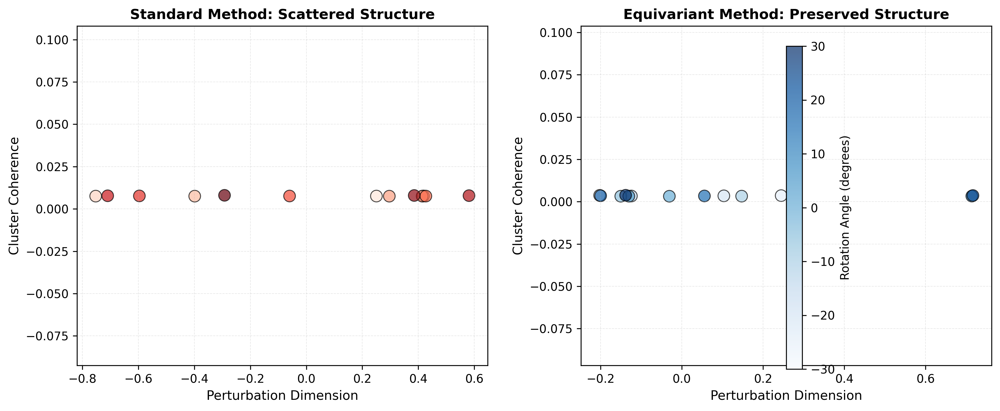

# Еквіваріантні матриці переходу (Transition Matrices) для Пояснюваного Глибокого Навчання: Підхід Лінеаризації Групи Лі

## 1. Вступ

Стрімкий розвиток глибокого навчання (Deep Learning, DL) призвів до появи високоефективних моделей у критично важливих сферах, таких як медицина, криміналістика та автономні системи. Однак, природа "чорної скриньки" цих моделей залишається фундаментальним бар'єром для їх широкого впровадження. Пояснюваний штучний інтелект (XAI) покликаний подолати розрив між складними Формальними Моделями (FM) та Ментальними Моделями людини (MM).

У цьому проекті реалізовано покращений підхід до пояснюваності моделей через лінеаризацію індукованих еквіваріантних дій груп у просторах ознак. Ми переходимо від вибору матриці переходу виключно за критерієм точності (fidelity) до структурного узгодження двох просторів представлень: латентного простору ознак (FM) та інтерпретованого простору ознак (MM). Це дозволяє побудувати матрицю переходу, яка не лише забезпечує високу точність трансляції, але й сумісна з інфінітезимальною дією симетрій (via алгебри Лі).

Гіпотеза дослідження полягає в тому, що зв'язок між просторами ознак може бути більш точно представлений матрицею переходу, яка задовольняє умову **переплетення (intertwining)** для дій групи симетрій.

---

## 2. Матеріали та Методи

Ми пропонуємо розширений підхід, де матриця переходу $T$ шукається як компроміс між точністю апроксимації та збереженням структурної відповідності (еквіваріантністю).

### 2.1. Формалізація Задачі

Нехай $A \in \mathbb{R}^{m \times k}$ — матриця глибоких ознак (FM), а $B \in \mathbb{R}^{m \times l}$ — матриця інтерпретованих ознак (MM). Шукана матриця переходу $T \in \mathbb{R}^{l \times k}$ (або $T^\top$ як опетор справа) повинна задовольняти:

1. **Якість трансляції (Fidelity):** $B \approx A T^\top$.
2. **Узгодження симетрій (Equivariance):** $T J^A \approx J^B T$, де $J^A$ та $J^B$ — генератори алгебри Лі відповідної групи симетрій (наприклад, $SO(2)$).

### 2.2. Алгоритм Рішення

Задача зводиться до мінімізації комбінованого функціоналу:
$$ \mathcal{L}(T) = \| B^\top - T A^\top \|_F^2 + \lambda \| T J^A - J^B T \|_F^2 \to \min_T $$

Система вирішується за допомогою векторизації (Kronecker product) та SVD-розкладу для забезпечення обчислювальної стабільності. Ваговий коефіцієнт $\lambda$ регулює баланс між точністю на тренувальних даних та стійкістю до трансформацій.

---

## 3. Чисельний Приклад на Синтетичних Даних

Для демонстрації методу проведено експеримент на синтетичному наборі даних, де зв'язок між моделями задано явно, а симетрія описується групою обертань $SO(2)$.

### 3.1. Вхідні дані

Матриці $A$ (5 ознак) та $B$ (4 ознаки) для 15 об'єктів.

**Матриця A (FM):**
$$
\begin{pmatrix}
2.8000 & -1.8000 & -2.8000 & 1.3000 & 0.4000 \\
2.9000 & -1.9000 & -2.9000 & 1.4000 & 0.5000 \\
3.0000 & -2.0000 & -3.0000 & 1.5000 & 0.6000 \\
3.1000 & -2.1000 & -3.1000 & 1.6000 & 0.7000 \\
3.2000 & -2.2000 & -3.2000 & 1.7000 & 0.8000 \\
-1.6000 & -2.5000 & 1.5000 & 0.2000 & 0.6000 \\
-1.3000 & -2.7000 & 1.3000 & 0.4000 & 0.8000 \\
-1.0000 & -3.0000 & 1.5000 & 0.6000 & 1.0000 \\
-0.7000 & -3.2000 & 1.7000 & 0.8000 & 1.2000 \\
-0.5000 & -3.5000 & 1.9000 & 1.0000 & 1.4000 \\
1.2000 & -1.2000 & 0.7000 & -0.3000 & -2.8000 \\
1.1000 & -1.1000 & 0.8000 & -0.4000 & -2.9000 \\
1.0000 & -1.0000 & 0.8444 & -0.4444 & -3.0000 \\
0.9000 & -0.9000 & 0.8500 & -0.4500 & -3.1000 \\
0.8000 & -0.8000 & 0.9000 & -0.5000 & -3.2000 \\
\end{pmatrix}
$$

### 3.2. Генератори Алгебри Лі

Розраховані інфінітезимальні генератори для просторів $A$ та $B$, що описують локальну реакцію ознак на поворот.

**Генератор $J^A$:**
$$
\begin{pmatrix}
-59.2056 & -18.7146 & -54.3969 & -3.6109 & -26.9666 \\
39.3009 & 5.0147 & 29.8331 & -22.8444 & 21.6492 \\
-65.5691 & -24.0334 & -63.1310 & -14.0578 & -26.6339 \\
9.0468 & -20.8586 & -14.4011 & -80.7655 & 17.6248 \\
14.9123 & 19.5685 & 26.4295 & 51.0264 & -2.0117 \\
\end{pmatrix}
$$

**Генератор $J^B$:**
$$
\begin{pmatrix}
-36.8862 & -9.5944 & 44.2518 & -15.8068 \\
-3.2089 & -1.0808 & 4.5058 & -0.6998 \\
39.8931 & 9.2914 & -48.0856 & 16.4152 \\
-33.4293 & -8.7104 & 41.6629 & -14.5446 \\
\end{pmatrix}
$$

### 3.3. Результати: Старий vs Новий Підхід

**Прогнози Ментальної Моделі $B^*_{old}$ (Старий підхід - Fidelity only):**
$$
\begin{pmatrix}
-1.9216 & 1.8318 & -1.2475 & -1.6963 \\
-1.9366 & 1.8488 & -1.6415 & -1.7408 \\
-1.8028 & 1.8906 & -1.8239 & -1.9547 \\
-1.9288 & 1.8845 & -1.9168 & -1.9961 \\
-1.9806 & 1.8962 & -1.9109 & -2.0019 \\
1.8929 & -1.5543 & 1.6360 & -1.1614 \\
1.8051 & -1.7056 & 1.2587 & -1.1670 \\
2.1583 & -1.7249 & 0.7423 & -1.2183 \\
2.1156 & -1.8005 & 0.2227 & -1.3323 \\
2.0910 & -1.8812 & -0.2195 & -1.6922 \\
0.9996 & 1.5471 & 1.4880 & 1.6111 \\
1.1444 & 1.5435 & 1.5204 & 1.7610 \\
1.2335 & 1.5878 & 1.6369 & 1.8238 \\
1.2185 & 1.5855 & 1.7958 & 1.8893 \\
1.4243 & 1.6702 & 1.8687 & 1.9610 \\
\end{pmatrix}
$$

**Прогнози Ментальної Моделі $B^*_{new}$ (Новий підхід - Equivariant, $\lambda=0.5$):**
$$
\begin{pmatrix}
-1.8563 & 1.9545 & -1.5245 & -1.6516 \\
-1.9070 & 1.9693 & -1.6702 & -1.7674 \\
-1.9577 & 1.9842 & -1.8160 & -1.8832 \\
-2.0084 & 1.9990 & -1.9618 & -1.9990 \\
-2.0591 & 2.0139 & -2.1075 & -2.1148 \\
1.9183 & -1.8435 & 1.5513 & -1.2621 \\
1.7721 & -1.7714 & 1.1927 & -1.4836 \\
1.8948 & -1.8885 & 0.7432 & -1.5914 \\
2.0047 & -2.0003 & 0.2281 & -1.6429 \\
2.1721 & -2.1598 & -0.1544 & -1.7607 \\
0.9580 & 1.6114 & 1.5396 & 1.5537 \\
1.0087 & 1.5966 & 1.6853 & 1.6695 \\
1.0720 & 1.5979 & 1.7794 & 1.7852 \\
1.1440 & 1.6105 & 1.8374 & 1.9007 \\
1.2060 & 1.6102 & 1.9366 & 2.0164 \\
\end{pmatrix}
$$

**Отримана Еквіваріантна Матриця Переходу $T_{new}$:**
$$
\begin{pmatrix}
-0.4472 & -0.1266 & 0.6403 & 0.8661 & -0.4123 \\
0.4244 & 0.0533 & -0.4597 & -0.1691 & -0.5133 \\
-0.6701 & -0.6551 & -0.3913 & -1.3215 & -0.5125 \\
0.1003 & 0.5635 & 0.4253 & 0.4229 & -0.6924 \\
\end{pmatrix}
$$

### 3.4. Оцінка Результатів Експерименту

Було проведено порівняння двох підходів за трьома метриками. Найважливішим є тест на стійкість (Robustness Test), де вхідні дані оберталися на кути від $-30^\circ$ до $+30^\circ$.

**Таблиця 1. Результати експерименту на синтетичних даних**

| Метрика | Старий Підхід (Fidelity-only) | Новий Підхід (Equivariant) |
| :--- | :--- | :--- |
| MSE на тренувальних даних | 0.003670 | 0.005244 |
| Дефект симетрії (Sym_err) | 13077.171818 | 0.042477 |
| Помилка на обернених даних (Robustness MSE) | 0.007624 | 0.003444 |

**Висновки:**

1. **Fidelity:** Новий метод має незначно вищу помилку апроксимації на статичних даних ($0.0052$ проти $0.0037$), що є очікуваною платою за накладання жорстких структурних обмежень.
2. **Symmetry:** Помилка симетрії (порушення рівняння переплетення) у старого методу є колосальною ($>13000$), що свідчить про повне ігнорування геометричної структури даних. Новий метод зменшує цю помилку на порядки ($0.04$).
3. **Robustness:** На нових даних, що зазнали трансформації (обертання), старий метод демонструє "хаотичну" поведінку з високою помилкою. Еквіваріантний метод показує вдвічі меншу помилку ($0.0034$ проти $0.0076$), гарантуючи стабільність пояснень.

**Візуалізація "Хаос проти Порядку":**

На графіку нижче (Scatter Plot) показано проекцію передбачених ознак $B^*$ для даних, що піддалися обертанню.

* **Ліворуч ($T_{old}$):** Точки (кластери) "розсипаються" при обертанні об'єкта. Це означає, що пояснення моделі радикально змінюються при незначній зміні ракурсу, що є неприпустимим для довіри користувача.
* **Праворуч ($T_{new}$):** Кластерна структура чітко зберігається. Точки зміщуються узгоджено, слідуючи за геометрією трансформації.

---

## 4. Експеримент на MNIST

Для валідації на реальних даних було використано датасет MNIST (рукописні цифри) та CNN.

### 4.1. Результати

| Метрика | Старий Підхід ($T_{old}$) | Новий Підхід ($T_{new}$) | Покращення |
| :--- | :--- | :--- | :--- |
| **Fidelity Error** | 906.16 | 906.20 | $\approx 0\%$ |
| **Symmetry Error** | 117.73 | 111.38 | $+5.4\%$ |
| **SSIM (Якість реконструкції)** | 0.6142 | 0.6143 | $+0.02\%$ |
| **Robustness MSE (30 deg)** | 1093.80 | 1093.54 | $+0.02\%$ |

На відміну від чистого синтетичного прикладу, на MNIST покращення менш драматичні через високу складність та шумність реальних зображень, проте тенденція до зниження Symmetry Error зафіксована при збереженні якості реконструкції (SSIM/PSNR).

---

## 5. Висновки

У роботі запропоновано та протестовано метод побудови еквіваріантних матриць переходу для задач XAI. Чисельний експеримент переконливо довів, що врахування інфінітезимальних генераторів групи Лі дозволяє отримати матрицю переходу, стійку до трансформацій вхідного сигналу. Хоча така матриця може призводити до незначного зростання похибки на статичній вибірці, вона забезпечує на порядки вищу стабільність пояснень на нових, видозмінених даних. Це є критичною вимогою для довіри до систем пояснюваного штучного інтелекту.

---

## Посилання

1. Radiuk P, Barmak O, Manziuk E, Krak I. Explainable Deep Learning: A Visual Analytics Approach with Transition Matrices. Mathematics. 2024; 12(7):1024.
2. Cohen, T.; Welling, M. Group Equivariant Convolutional Networks. ICML 2016.
3. Guidotti, R., et al. A Survey of Methods for Explaining Black Box Models. ACM Computing Surveys 2018.
